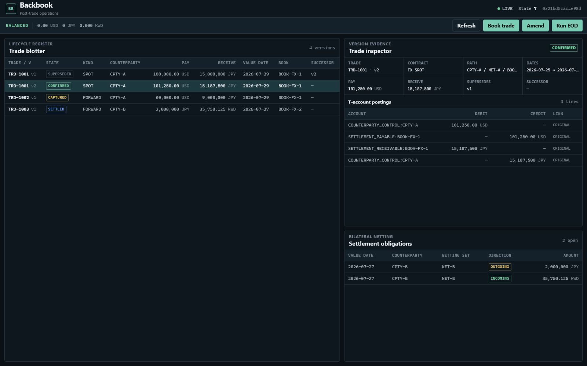
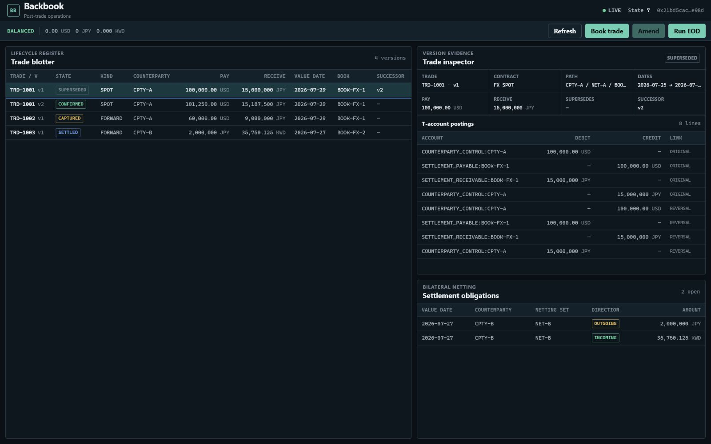
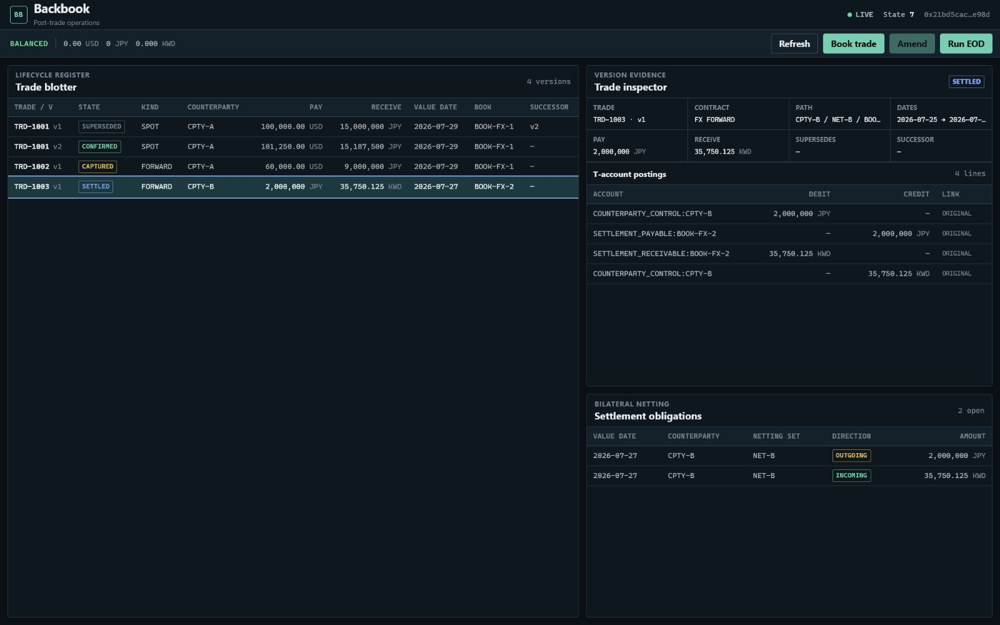
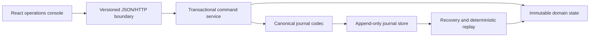

# Backbook

Backbook is a C++20 post-trade lifecycle and double-entry ledger demo for
explicit FX cashflows. It accepts commands through a local HTTP service,
enforces hierarchical settlement limits, records accepted commands in an
append-only journal, derives bilateral settlement obligations, and serves a
React operations console.

The project is intentionally narrow. It demonstrates transactional state
changes and deterministic recovery; it is not a pricing engine, payment
network, market gateway, or production risk system.

## Demo story

The canonical scenario in [`demo/day1.jsonl`](demo/day1.jsonl) runs through the
same command service used by the HTTP API:

1. Book and confirm `TRD-1001`.
2. Amend it atomically from version 1 to version 2.
3. Retain version 1 and its exact reversal postings.
4. Reject a second confirmation at the `BOOK-FX-1` USD limit without changing
   state, ledger, headroom, or journal.
5. Confirm and settle a KWD/JPY trade.
6. Produce one incoming and one outgoing bilateral settlement obligation.

The verified result contains seven accepted commands, one expected rejection,
four trade versions, sixteen postings, and two settlement obligations. Its
canonical state fingerprint is `0x21bd5cac4ef6e98d`.

## Operations console



The blotter retains every trade version while the inspector shows the selected
version's postings and links:



Settlement results preserve each currency's exponent and direction:



## Run the demo

Prerequisites:

- CMake 3.24 or newer
- Ninja
- A C++20 compiler: MSVC 14.50 or newer on Windows, or GCC 13 on Linux

The production frontend is committed in `web/dist`, so Node.js is not required
to build or run the C++ demo.

### Windows

Run from Visual Studio Developer PowerShell:

```powershell
cmake --preset msvc-debug
cmake --build --preset msvc-debug --parallel
.\build\msvc-debug\backbook-server.exe --demo
```

### Linux

```bash
cmake --preset gcc-debug
cmake --build --preset gcc-debug --parallel
./build/gcc-debug/backbook-server --demo
```

Open `http://127.0.0.1:8080`. Demo mode creates an isolated journal in the
operating system's temporary directory and prints its location, command counts,
fingerprint, and URL. Stop the server with `Ctrl+C`.

Use `--port 0` to select a free port, `--no-ui` to run only the API, or
`--journal <path>` to recover and continue a specific journal. The server binds
to loopback by default. A non-loopback bind requires both `--bind <address>` and
`--allow-non-loopback` and should be used only in a trusted environment.

## What is enforced

| Invariant | Enforcement |
| --- | --- |
| Ledger entries balance independently per currency | Private construction through a checked factory |
| Amendments preserve history | One prospective reversal-plus-rebook state transition |
| Rejected limits have no side effects | Journal append and snapshot publication occur only after prospective validation |
| Recovery is deterministic | Canonical framed encoding, CRC32 validation, ordered replay, and canonical state export |
| Competing confirmations cannot over-reserve headroom | Command execution is serialized; a concurrency test proves exactly one winner |
| T+2 respects both settlement calendars | Joint-business-day advancement across two explicit holiday sets with modified-following adjustment |

Money uses signed 64-bit minor units. USD, JPY, and KWD retain their different
currency exponents throughout the C++ domain, JSON contract, and browser
display. JSON carries monetary amounts, state versions, and fingerprints as
strings so JavaScript never routes them through an imprecise number.

## Business-date calculation

The pure domain library accepts two explicit holiday calendars and treats
Saturday, Sunday, or a holiday in either calendar as closed. T+2 starts on the
day after the trade date and advances only on days when both calendars are
open. Modified-following adjustment moves a closed date forward within its
month; if following would cross a month boundary, it rolls backward to the
first joint business day in the original month.

The application continues to store and journal the resulting explicit value
date. It does not infer jurisdictions, download calendar data, or invent
observance rules; callers remain responsible for supplying the two reviewed
holiday sets used for a calculation.

## Architecture



The domain library has no file, socket, HTTP, environment, clock, or logging
dependency. The service evaluates a complete prospective state, verifies ledger
and limit invariants, appends and flushes one command batch, and only then
publishes the immutable snapshot. Readers atomically load that snapshot without
holding the command mutex.

See [Architecture](docs/architecture.md) for the target boundaries, commit
sequence, journal recovery rules, and HTTP snapshot contract.

## HTTP surface

The local server exposes four versioned business routes and one operational
route:

```text
POST /api/v1/commands
GET  /api/v1/state
GET  /api/v1/ledger
GET  /api/v1/settlements
GET  /healthz
```

Success responses use `application/json`. Errors use
`application/problem+json`. Command bodies are limited to 64 KiB. The frontend
loads state, ledger, and settlement responses together and displays a new
snapshot only when their state versions and fingerprints agree.

## Test and rebuild

Run the native suite:

```powershell
ctest --preset msvc-debug --output-on-failure
```

or:

```bash
ctest --preset gcc-debug --output-on-failure
```

Rebuild the frontend with Node.js 24 and the committed lockfile:

```bash
cd web
npm ci
npm run typecheck
npm test
npm run build
git diff --exit-code -- dist
```

Run the post-release native sanitizer suite on Ubuntu 24.04 with Clang 18:

```bash
sudo apt-get install --no-install-recommends clang-18 libclang-rt-18-dev llvm-18
export ASAN_SYMBOLIZER_PATH="$(command -v llvm-symbolizer-18)"
cmake --preset clang-sanitizers
cmake --build --preset clang-sanitizers --parallel
ctest --preset clang-sanitizers --output-on-failure
```

This preset compiles and links the native suite with AddressSanitizer and
UndefinedBehaviorSanitizer, enables leak detection, and stops on the first
reported sanitizer failure.

The current verification baseline is 184 native tests on MSVC 19.51
(14.51 toolset), GCC 13.3.0, and Clang 18.1.3 with ASan and UBSan, plus 9
frontend tests on Node.js 24. See [Verification](docs/verification.md) for the
release checklist.

## Deliberate boundaries

Backbook has no authentication and is not designed for internet-facing use. It
does not calculate prices, rates, P&L, multilateral netting, nostro funding, or
payment schedules. Its holiday calendars are explicit caller-supplied data, not
a maintained market-calendar service. CRC32 detects accidental journal
corruption; it is not an authenticity mechanism. The FNV-1a state fingerprint
is a deterministic comparison value, not a cryptographic hash.

Third-party components and their pinned versions are listed in
[Third-Party Notices](THIRD_PARTY_NOTICES.md).
