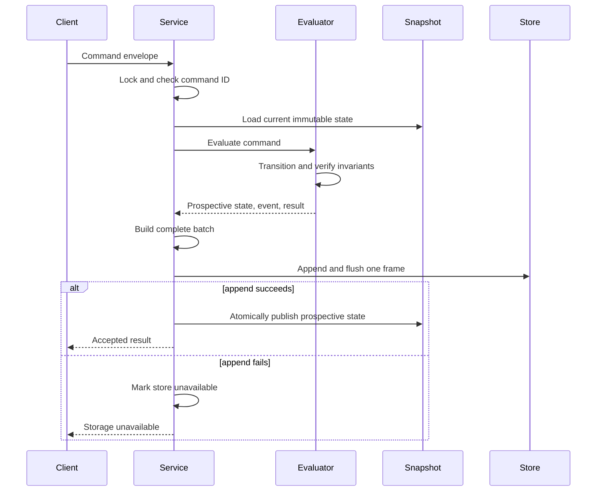

# Architecture

Backbook separates pure domain rules from durable command processing and the
local HTTP boundary. Dependencies point inward, and each target has one clear
reason to change.

## Target boundaries

| CMake target | Responsibility | Direct Backbook dependency |
| --- | --- | --- |
| `backbook-domain` | Values, lifecycle, ledger, limits, settlement, immutable state | None |
| `backbook-journal-codec` | Canonical command batches, frames, replay fold, fingerprint | `backbook-domain` |
| `backbook-storage` | Memory and file journal implementations | `backbook-journal-codec` |
| `backbook-service` | Validation, idempotency, transaction boundary, snapshot publication | `backbook-storage` |
| `backbook-server-core` | JSON DTO mapping, HTTP routes, static assets, canonical seed | `backbook-service` |
| `backbook-server` | CLI and composition root | `backbook-server-core` |

`JournalStore` is the intentional runtime-polymorphic boundary. The service owns
one store through `std::unique_ptr<JournalStore>` and publishes readers a
`std::shared_ptr<const State>` through the C++20 atomic shared-pointer facility.

## Command evaluation seam

`evaluate_command` is a pure, storage-free boundary inside `backbook-service`.
One exhaustive visit over the closed command variant performs the domain
transition and returns the prospective state, journal event, and command result
as one value. It also verifies ledger and limit invariants before the result can
reach the durability boundary.

This keeps command semantics in one mapping point while `CommandService`
retains responsibility for command-ID idempotency, serialisation, journal
commit, failure quarantine, and immutable snapshot publication. A
characterization test pins the existing event tags, result tags, canonical
request bytes, state versions, and final canonical fingerprint across every
command variant. Direct evaluator tests exercise successful evaluation and
typed domain rejection without constructing a journal store.

## Command commit sequence



The journal append is the commit point for this process model. A validation or
limit failure occurs before append and cannot change the journal or published
snapshot. An append failure publishes nothing and prevents further writes until
restart and recovery.

Command IDs are durable idempotency keys. An existing ID with identical
canonical request bytes returns the original logical result without appending.
Reusing the ID for different request bytes is rejected. Replay rebuilds the
index and the result summary needed to reproduce an idempotent response.

## Journal and recovery

Each accepted command is one framed batch:

```text
4 bytes  magic "BBK1"
1 byte   format version
4 bytes  payload length, little endian
N bytes  canonical payload
4 bytes  CRC32 of the payload
```

Canonical encoding uses explicit tags, fixed-width integers, length-prefixed
strings, ordered collections, epoch-day dates, and currency plus signed
64-bit minor units. It never serializes native structs, pointer values,
`size_t`, floating point, or unordered container iteration order.

Recovery scans frames from the beginning and folds valid batches into fresh
state. An incomplete final frame is a torn tail and is truncated to the last
valid boundary. A complete frame with a bad CRC, an unsupported version, or a
duplicate command ID is fatal corruption. Before replay, the service validates
the canonical command-request version, complete request shape, embedded command
ID, and command-to-event tag. Valid replay rebuilds idempotency, verifies ledger
totals, and publishes the recovered snapshot.

The canonical fingerprint is computed from an ordered state export. FNV-1a is
used only to compare deterministic state; it is not a security primitive.

## Domain transaction rules

Confirming a trade reserves the absolute outgoing cashflow at each node in:

```text
Group -> Counterparty -> NettingSet -> Book
```

Limits are independent per currency. The first breach is reported in
root-to-leaf order with the full path, currency, required minor units, and
remaining minor units.

Amending a confirmed trade is one prospective operation:

1. Release the previous reservation.
2. Reverse the previous postings exactly.
3. Create a complete replacement trade version.
4. Reserve the replacement outgoing cashflow.
5. Create the replacement postings.
6. Accept the whole operation or discard it.

The previous version remains queryable and links to its successor. The
replacement links back and remains confirmed.

End-of-day processing settles eligible confirmed versions and derives bilateral
obligations grouped by counterparty, netting set, value date, and currency. Zero
nets are omitted, and output is stable-sorted.

## Business-date convention

`HolidayCalendar` owns a sorted, duplicate-free set of explicit closed dates.
Weekends are closed independently of that set. A joint business day must be
open in both calendars supplied to the calculation.

T+2 counts two joint business days beginning after the trade date. The result is
passed through modified-following adjustment: move forward while the adjusted
date remains in the original month, otherwise roll backward to the first joint
business day in that month. Supported-date exhaustion and a month with no joint
business day are typed failures.

This calculation remains in `backbook-domain`. It has no clock, environment,
filesystem, or external calendar dependency. Commands and journal events retain
the calculated explicit value date, so the existing wire format and
deterministic replay contract do not change.

## HTTP snapshot contract

Every business read carries:

```json
{
  "stateVersion": "7",
  "stateFingerprint": "0x21bd5cac4ef6e98d",
  "data": {}
}
```

The strings identify the exact immutable snapshot used to build the response.
The browser requests state, ledger, and settlements concurrently. It commits
them together only when both identifiers agree, retries one mismatch, and
otherwise retains the last valid snapshot as stale.

The server binds to `127.0.0.1` by default and serves only `web/dist`.
`--no-ui` disables static mounting. There is no cross-origin policy because the
console and API share one origin.
